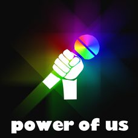

# Power of us

## 製品概要
### Live x Tech

### 背景（製品開発のきっかけ、課題等）
〜ライブに楽曲+αの楽しみを。〜

  近年の技術向上により、高音質CDやハイレゾ対応の音楽機器が増え、ライブに直接出向かなくてもクオリティの高い楽曲を聞くことが可能になった。そのことにより、ライブに行く人の数も減少することが懸念される。観客参加型のライブを作り上げることにより、その問題を防ごうと考えた。アーティストのライブといえば、オーディエンスと一体となって盛り上がっていくものが多い。そこで、オーディエンスに+αの楽しみがないか考えた。ライブでよく見かける、サイリウムやペンライト、その持っている色で誰を応援しているのかがわかる。「誰が一番応援されているのか可視化できたらおもしろそう。」そういった考えから今回のプロダクト「Power of us」は生まれた。

### 製品説明（具体的な製品の説明）
  ライブで使われるサイリウムやペンライトの代わりにスマートフォンを使用し、加速度センサの動きを検知して、スマートフォンがどれだけ振られているか数値化する。（例えば、ももクロがライブを開催した場合）端末側はまず、QRコードから推しメンの色（誰を応援したいか)を決める。ライブのスタートと同時に検知が開始されるので、スマホを所持している人はペンライトのように縦横に振る。スマホは振る強さによってライトが明るくなる。振れば振るほど明るくなる。つまり、よく振られている色が明るくなるので（相対的に）誰がより応援されているのかがわかる。サーバー側で端末から送られるポイント（加速度センサの変化量)を合計し画面（実際のライブではスクリーン）に表示させる。ライブに+αの盛り上がりを生み出せる。

### 特長

#### 1. リアルタイム通信
ユーザーのアクションをリアルタイム通信によって取得している。
#### 2. ユーザーアクションの可視化
加速度センサを用い、ライトの明るさや合計ポイントにより視覚によるユーザーアクションの取得を可能にした。
#### 3. 徹夜でつくったプロダクト
全員ねてません。。。

### 解決出来ること
高音質のCDやWalkmanなどの音楽端末の進歩によって、通勤通学中にハイクオリティな音楽を聞くことができる。観客参加型のライブにより、観客の減少を防ぐことができる。

### 今後の展望
今回は実現できなかったが、今後改善すること、どのように展開していくことが可能かについて記載をしてください。

## 開発内容・開発技術
### 活用した技術
#### API・データ
今回スポンサーから提供されたAPI、製品などの外部技術があれば記述をして下さい。
* スマートフォン
* Swift 
* Node.js 

#### フレームワーク・ライブラリ・モジュール
* illustlator 
* Webソケット（socket.io）

#### デバイス
* iOSデバイス

